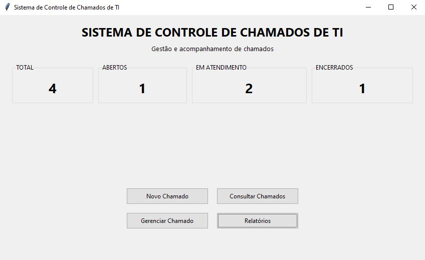
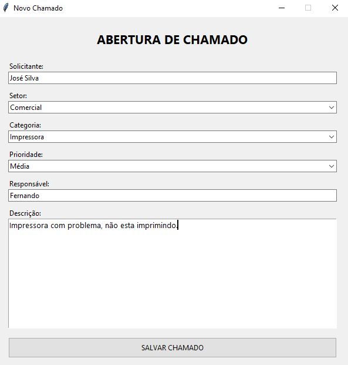
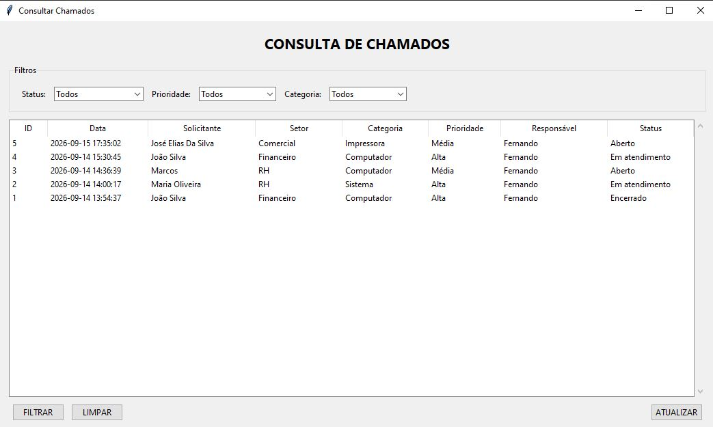
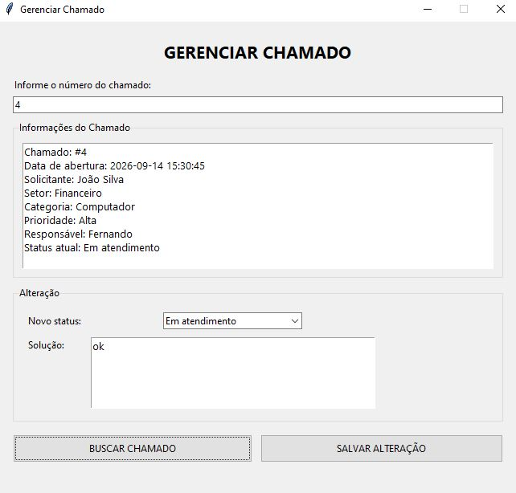
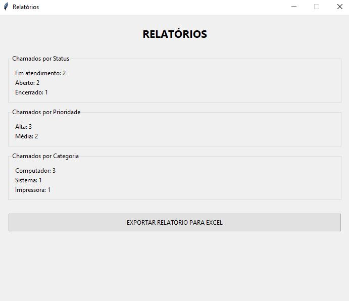
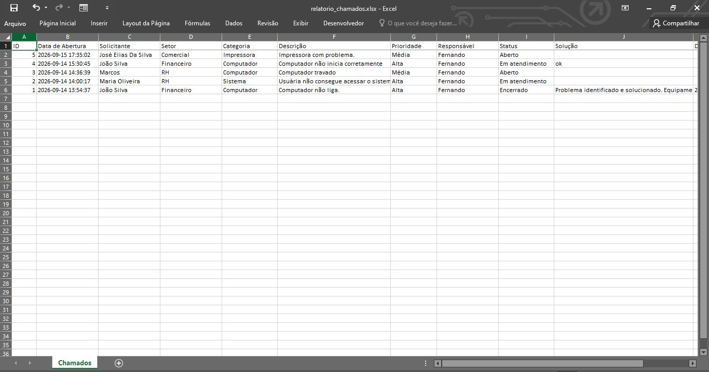

# Sistema de Controle de Chamados de TI

Sistema desktop desenvolvido em **Python** para gerenciamento de chamados de suporte técnico, permitindo registrar, consultar, acompanhar, atualizar e encerrar solicitações de usuários.

O projeto foi desenvolvido como parte do meu portfólio profissional com foco na aplicação prática de conhecimentos em **Python, SQL, banco de dados, desenvolvimento de sistemas, interface gráfica e geração de relatórios**.

---

## Sobre o projeto

O sistema simula o funcionamento de uma ferramenta interna de atendimento de TI, onde usuários podem registrar problemas ou solicitações e a equipe de suporte pode acompanhar o andamento dos chamados.

A aplicação permite controlar todo o ciclo de atendimento:

**Abertura → Atendimento → Solução → Encerramento**

Além do gerenciamento dos chamados, o sistema disponibiliza indicadores e relatórios para facilitar o acompanhamento das solicitações.

---

## Objetivos

O projeto foi desenvolvido com os seguintes objetivos:

* Praticar desenvolvimento de aplicações desktop com Python.
* Trabalhar com banco de dados relacional.
* Aplicar comandos SQL para inclusão, consulta e atualização de dados.
* Desenvolver uma interface gráfica funcional.
* Implementar filtros e consultas de informações.
* Criar indicadores para acompanhamento dos chamados.
* Gerar relatórios para análise dos dados.
* Integrar a aplicação com arquivos Excel.
* Aplicar organização modular de código.
* Desenvolver um projeto completo para portfólio profissional.

---

## Funcionalidades

### Cadastro de chamados

Permite registrar:

* Solicitante
* Setor
* Categoria
* Descrição do problema
* Prioridade
* Responsável pelo atendimento
* Data de abertura

O sistema gera automaticamente um número de identificação para cada chamado.

### Controle de status

Cada chamado pode possuir um dos seguintes status:

* **Aberto**
* **Em atendimento**
* **Encerrado**

Quando um chamado é encerrado, o sistema registra a solução aplicada e a data de encerramento.

### Consulta de chamados

A aplicação permite consultar os chamados cadastrados e utilizar filtros para facilitar a localização das informações.

Filtros disponíveis:

* Status
* Prioridade
* Categoria

Também é possível atualizar a listagem após novos registros ou alterações.

### Gerenciamento de chamados

Através da tela de gerenciamento é possível:

* Localizar um chamado pelo ID.
* Visualizar os dados do atendimento.
* Alterar o status.
* Registrar ou atualizar a solução.
* Encerrar o chamado.
* Atualizar automaticamente os indicadores do sistema.

### Indicadores

A tela principal apresenta indicadores gerais do atendimento:

* Total de chamados
* Chamados abertos
* Chamados em atendimento
* Chamados encerrados

Esses indicadores permitem visualizar rapidamente a situação atual dos chamados.

### Relatórios

O sistema apresenta informações agrupadas por:

* Status
* Prioridade
* Categoria

Também é possível exportar os chamados cadastrados para uma planilha Excel.

---

## Relatório em Excel

A aplicação gera automaticamente um arquivo:

```text
relatorios/relatorio_chamados.xlsx
```

O relatório contém informações como:

* ID do chamado
* Data de abertura
* Solicitante
* Setor
* Categoria
* Descrição
* Prioridade
* Responsável
* Status
* Solução
* Data de encerramento

A exportação permite utilizar os dados do sistema para análises, controles internos e acompanhamento dos atendimentos.

---

## Tecnologias utilizadas

| Tecnologia   | Utilização                         |
| ------------ | ---------------------------------- |
| **Python**   | Desenvolvimento da aplicação       |
| **Tkinter**  | Interface gráfica                  |
| **SQLite**   | Banco de dados                     |
| **SQL**      | Consultas e manipulação dos dados  |
| **OpenPyXL** | Geração do relatório Excel         |
| **Git**      | Controle de versão                 |
| **GitHub**   | Hospedagem e publicação do projeto |

---

## Banco de dados

O projeto utiliza **SQLite**, um banco de dados relacional integrado ao Python, não sendo necessária a instalação de um servidor de banco de dados separado.

A aplicação cria e utiliza o arquivo:

```text
banco/chamados.db
```

### Tabela principal

A tabela `chamados` armazena informações relacionadas ao atendimento, incluindo:

```text
id
data_abertura
solicitante
setor
categoria
descricao
prioridade
responsavel
status
solucao
data_encerramento
```

O sistema utiliza consultas SQL para:

* Inserção de chamados
* Consulta de registros
* Filtragem de dados
* Atualização de chamados
* Agrupamento de informações
* Geração de indicadores
* Preparação dos dados para relatórios

---
Controle_Chamados_TI/
│
├── banco/
│   └── chamados.db
│
├── src/
│   ├── banco.py
│   ├── chamados.py
│   ├── relatorios.py
│   └── main.py
│
├── imagens/
│   ├── menu-principal.png
│   ├── novo-chamado.png
│   ├── consulta-chamados.png
│   ├── gerenciar-chamado.png
│   ├── relatorios.png
│   └── relatorio-excel.png
│
├── relatorios/
│   └── relatorio_chamados.xlsx
│
├── .gitignore
└── README.md
```

### Organização dos arquivos

**`main.py`**

Responsável pela interface gráfica e navegação entre as telas do sistema.

**`banco.py`**

Responsável pela conexão com o SQLite, criação da tabela, atualização dos chamados e indicadores.

**`chamados.py`**

Contém as operações relacionadas ao cadastro, consulta e obtenção dos chamados.

**`relatorios.py`**

Responsável pelas consultas de indicadores, agrupamentos e exportação dos dados para Excel.

---

## Fluxo do sistema

```text
                    ┌─────────────────────┐
                    │   MENU PRINCIPAL    │
                    └──────────┬──────────┘
                               │
          ┌────────────────────┼────────────────────┐
          │                    │                    │
          ▼                    ▼                    ▼
   Novo Chamado          Consultar Chamados   Gerenciar Chamado
          │                    │                    │
          └────────────────────┼────────────────────┘
                               │
                               ▼
                         Banco SQLite
                               │
                               ▼
                         ┌───────────┐
                         │ Relatórios│
                         └─────┬─────┘
                               │
                               ▼
                         Excel (.xlsx)
```

---

## Demonstração

### Tela principal



A tela inicial apresenta os principais indicadores do sistema e disponibiliza acesso às funcionalidades.

### Cadastro de chamado



Tela utilizada para registrar uma nova solicitação de suporte.

### Consulta de chamados



Permite visualizar os chamados cadastrados e utilizar filtros para localizar informações específicas.

### Gerenciamento de chamado



Permite consultar um chamado pelo ID, alterar seu status e registrar a solução aplicada.

### Relatórios



Apresenta informações agrupadas para acompanhamento dos chamados.

### Exportação para Excel



Relatório gerado automaticamente pelo sistema utilizando OpenPyXL.

---

## Como executar o projeto

### 1. Pré-requisito

É necessário ter o **Python 3** instalado.

### 2. Clonar o repositório

```bash
git clone https://github.com/BuenoFernando/controle-chamados-ti.git
```

### 3. Acessar a pasta

```bash
cd controle-chamados-ti
```

### 4. Executar o sistema

```bash
python src/main.py
```

O banco de dados SQLite será utilizado pela aplicação e os arquivos necessários serão gerados conforme a utilização do sistema.

---

## Relatórios

Para gerar o relatório dos chamados diretamente pelo módulo de relatórios:

```bash
python src/relatorios.py
```

A exportação para Excel pode ser realizada através da funcionalidade de relatórios da aplicação.

---

## Conceitos demonstrados

Este projeto demonstra conhecimentos práticos em:

* Python
* Programação estruturada
* Modularização
* Interface gráfica
* SQLite
* SQL
* CRUD
* Consultas e filtros
* Manipulação de dados
* Indicadores
* Relatórios
* Exportação para Excel
* Organização de projetos
* Controle de versão com Git
* Publicação de projetos no GitHub

---

## Possíveis evoluções

Como projeto de portfólio, a aplicação foi mantida enxuta e funcional. Algumas possibilidades de evolução seriam:

* Sistema de login e controle de usuários.
* Histórico completo de alterações.
* Controle de SLA.
* Registro de comentários no atendimento.
* Dashboard com gráficos.
* Banco de dados em servidor.
* API para integração com outras aplicações.
* Controle de permissões por perfil de usuário.

Essas funcionalidades não fazem parte da versão atual.

---

## Objetivo profissional

Este projeto faz parte do meu portfólio de transição para a área de Tecnologia da Informação, demonstrando a aplicação prática de conhecimentos adquiridos em **Engenharia da Computação**, programação, banco de dados, análise de sistemas e automação.

O objetivo é desenvolver soluções simples, organizadas e funcionais para problemas encontrados em ambientes corporativos.

---

## Autor

**Fernando Bueno**

**Engenheiro de Computação | Analista de Sistemas | Analista de TI**

### Contato

[LinkedIn](https://www.linkedin.com/in/fernando-cesar-bueno/)

[GitHub](https://github.com/BuenoFernando)
